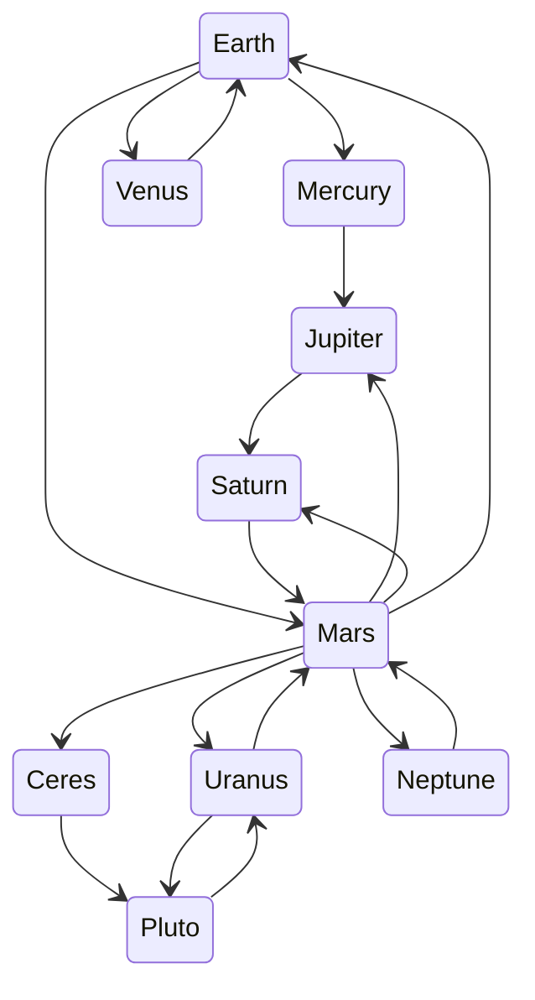

# Solar System Explorer

Solar System Explorer is a text-based adventure game that allows you to explore the solar system. Find out interesting facts and log them to your ship's log.

## Running the game

To run the game, simply run the following command:

```bash
python3 solarsystemexplorer.py
```

Or run it interactively in your web browser: [Solar System Explorer](https://replit.com/@TimelessP/Solar-System-Explorer?v=1)

*Note: Tested on Python 3.11*

## Valid routes

Your ship has some quirks though, and its navigational system only has a partial set of routes for travelling to all the planets/dwarf planets. This map might be of some help:


